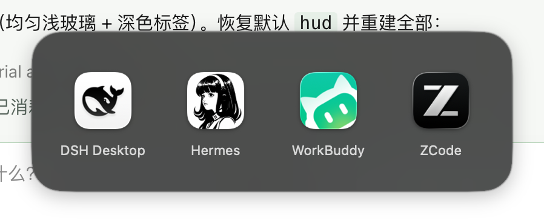
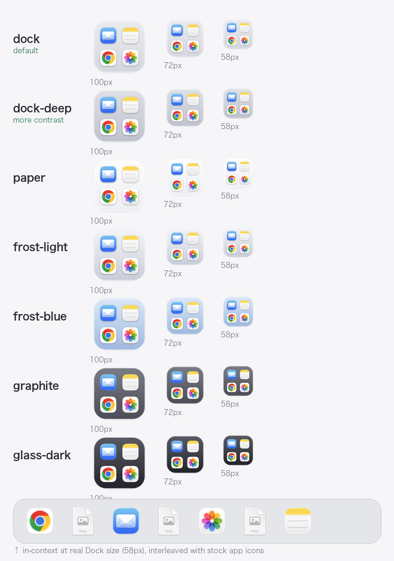

<div align="center">

# dockgroup

**iPhone-style app folders for your macOS Dock — without a third-party dock replacement.**

把 macOS Dock 里的一堆 App 折叠成一个可点击展开的图标 —— 不改系统 Dock，不装 Dock 替代品。



</div>

---

## 这是什么

macOS 的 Dock 有个老问题：图标越加越多，一条栏塞二十几个，找个 App 得用眼睛扫一遍。
iPhone 早就用文件夹解决了，但 macOS **从来没把这个交互搬过来** —— 你把一个 Dock 图标拖到另一个上面，什么都不会发生。

`dockgroup` 把这件事补齐：给它一组 App，它生成一个图标，点一下在原位弹出这些 App 的网格，再点直接启动。

```
改前：App · Safari · Chrome · ego · 信息 · 微信 · QQ · WorkBuddy · Clash · …… · ZCode   （22 个）
改后：App · Safari · Chrome · ego · 信息 · 微信 · QQ · [AI] · Clash · …… · 系统设置      （16 个）
                                                        └─ 点击展开 4 个 agent 类 App
```

## 特性

- **不需要第三方 Dock** —— 不改系统 Dock，不装 Dock 替代品，没有常驻守护进程（启动器只在用过后短暂驻留，10 分钟无操作自动退出）
- **图标是实时合成的** —— 读取组内每个 App 的原始图标，拼成 2×2 拼贴图；App 换图标后重跑一次就同步
- **可以放在左侧 App 区** —— 位置就在被折叠 App 原来待的地方，不是被甩到最右边
- **分组文件夹是唯一事实来源** —— 往文件夹里拖 App 就等于加进分组，不需要改配置
- **5 种图标风格** —— 见下方对比，`paper` / `frost-light` / `frost-blue` / `graphite` / `glass-dark`
- **一键回滚** —— 每次改 Dock 前自动备份 plist，`restore` 秒回原样

## 界面与风格

面板弹在 Dock 图标正上方，点空白处 / Esc / 切走即自动关闭（见上方示意图）。
图标风格在 64px 真实 Dock 尺寸下的表现：



> 实测结论：**只有实心卡片和实心深色玻璃能撑住 64px**。
> 半透明淡底、无底板纯拼贴、纯描边框这三种在真实 Dock 尺寸下容器会消失，只剩几个图标散着，全部淘汰。

## 安装

```bash
git clone https://github.com/wjvalue/macos-dock-folders.git
cd macos-dock-folders

# 体检：确认依赖齐全
/usr/bin/python3 scripts/dockgroup.py doctor
```

依赖：macOS 上自带的东西 —— `/usr/bin/python3`（含 Pillow）、`osascript`，
以及 [Xcode Command Line Tools](https://developer.apple.com/xcode/resources/) 提供的 `swiftc` / `codesign` / `iconutil` / `sips`。
若缺 CLT：`xcode-select --install`。

```bash
# 建议加个别名
alias dg='/usr/bin/python3 "'"$PWD"'/scripts/dockgroup.py"'
```

## 快速开始

```bash
# 1. 扫描当前 Dock，生成起始配置
$ dg init

# 2. 建一个分组（App 名支持模糊匹配，也会去 LaunchServices 里找）
$ dg new AI "WorkBuddy" "ZCode" "Hermes" "DSH Desktop"
已添加分组「AI」（4 个 App）

# 3. 先看图标长什么样（不动 Dock）
$ dg preview AI

# 4. 满意了再写进 Dock
$ dg apply AI
```

## 用法

```
dg doctor                体检：检查依赖是否齐全
dg init [--force]        扫描当前 Dock，生成起始 groups.json
dg new 组名 "App" ...     新建分组
dg preview [组名...]     预览拼贴图标，不改动 Dock
dg apply   [组名...]     生成并写入 Dock（不填 = 全部启用的分组）
dg apply --keep-originals    保留左侧原图标，不自动摘除重复项
dg rebuild               按文件夹现状刷新图标并重启 Dock
dg list                  查看配置 + 文件夹现状 + Dock 挂载状态
dg open    组名          在 Finder 里打开分组文件夹（往里面拖 App）
dg test    组名          手动启动一次，验证点击展开效果
dg logs    组名          查看运行日志（面板几何 + 点击事件轨迹）
dg remove  组名...       从 Dock 移除（保留文件夹）
dg clean   组名...       从 Dock 移除并删除文件夹
dg watch-install         安装自动监听：文件夹一变就自动刷新图标
dg watch-uninstall       卸载自动监听
dg restore               用最近一次备份恢复 Dock
```

## 日常维护

**分组文件夹是唯一事实来源。** 启动器在运行时现读该文件夹，所以加了 App 立刻就能点；只有拼贴图标需要刷新。

```bash
dg open AI
```

| 想做什么 | 怎么做 |
|---|---|
| 加 App | 按住 **⌘ ⌥** 从「应用程序」拖进文件夹 = 建别名 |
| 删 App | 删掉文件夹里对应的别名 |
| 改名 / 排序 | 重命名别名（网格和 Dock 都按名称排序） |
| 刷新图标 | `dg rebuild` |

> ⚠️ **千万别不按修饰键直接拖** —— 那是「移动」，会真的把 App 搬出 `/Applications`。

装了 `watch-install` 的话，连 `rebuild` 都不用跑。

## 配置 `groups.json`

```json
{
  "style": "paper",
  "groups": [
    {
      "name": "AI",
      "enabled": true,
      "placement": "left",
      "apps": ["/Applications/WorkBuddy.app", "/Applications/ZCode.app"]
    }
  ]
}
```

| 字段 | 说明 |
|---|---|
| `style` | 全局图标风格，见上方对比表 |
| `enabled` | `apply` 不带参数时是否应用它；`apply <组名>` 会忽略此项 |
| `placement` | `left`（默认，启动器 App）/ `right`（原生文件夹 Stack） |
| `after` | 可选。显式指定插在哪个 App 后面；不写则**自动落位**到被折叠 App 的原位置 |
| `apps` | 首次播种用；文件夹建好之后以文件夹内容为准 |

配置默认读 `~/Dock Groups/groups.json`（可用环境变量 `DOCKGROUP_HOME` 改落盘目录）。

## 两种模式：为什么默认是 App 而不是文件夹

Dock 支持把文件夹放进去（Stack），但它有个硬限制：

| `placement` | Dock tile 类型 | 位置 | 点击行为 |
|---|---|---|---|
| `left`（默认） | 启动器 **App**（`file-tile`） | 左侧 App 区，任意位置 | 弹出图标网格 ✅ |
| `right` | 文件夹 **Stack**（`directory-tile`） | **只能在分隔线右侧** | 原生 Stack 网格 |

文件夹 tile 写进 `persistent-apps`（左侧区）后 Dock 是接受的、重启也不弹回去，
**但点击会打开 Finder 窗口，不会弹网格** —— Stack 的弹窗逻辑和 tile 所在区域绑定，
没有任何 plist 字段能改。

所以要在左侧位置 + 点击展开，只能自己做成 App：
`scripts/launcher/main.swift` 会编译出一个约 130 KB 的启动器，`LSUIElement=true`
（不留运行圆点、不进 Cmd-Tab），点击后在图标正上方弹出一个毛玻璃网格面板。

## 落盘位置

```
~/Dock Groups/
├── AI/                     ← 分组文件夹（App 别名 + 自定义图标），事实来源
├── .apps/AI.app/           ← 生成的启动器 App
├── .cache/                 ← 拼贴图标、App 图标缓存、预览图、运行日志
├── .backup/                ← 每次改 Dock 前自动备份的 plist
└── groups.json
```

## 出问题时

| 现象 | 处理 |
|---|---|
| 点击图标没反应 | 跑 `dg logs <组名>`，日志会指出断点：<br>· 只有 `=== launch`，没有 `mouseDown hit item` → 点击没送达视图<br>· 有 `mouseDown` 但没有 `launching` → 命中下标/路径有问题<br>· 有 `launching` 但 `openApplication` 报错 → LaunchServices 拒绝启动<br>· 出现 `dismiss: click outside panel` → 被误判成点了面板外 |
| 提示「应用程序"X"已不能再打开」 | 两种成因，都已修：<br>① 旧版每次 `apply/rebuild` 都重写 bundle，LaunchServices 因此作废 App 记录 → 现在内容没变就一个字节都不动<br>② 旧版用完立刻退出进程，连点时 Dock 会尝试再启动一个实例被拒 → 现在启动器常驻，第二次点击走 reopen 切换 |
| 点击打开的是 Finder 窗口 | 说明用的是文件夹 Stack 却在左侧 → 把 `placement` 改成 `left` 后 `apply` |
| 弹出栏被 Dock 挡住 | 已修（历史 bug：`NSPanel.isFloatingPanel` 会把窗口层级压到 3）。重跑 `apply` 重新编译 |
| 图标没跟着文件夹内容变 | `dg rebuild` |
| Dock 条目被系统丢弃 | `dg restore` 回滚，再手动把 App 拖回 Dock |
| 想彻底撤销 | `dg restore` |

更多实现细节和踩坑记录见 [`references/pitfalls.md`](references/pitfalls.md)。

## 作为 AI Agent Skill 使用

仓库根目录的 `SKILL.md` 是给 AI 编码助手（Claude Code / WorkBuddy 等）用的技能定义。
把它放进你的 skills 目录即可：

```bash
ln -s "$PWD" ~/.workbuddy/skills/macos-dock-folders
```

## 已知限制

- 左侧模式依赖手写 `persistent-apps`。macOS 不让你拖，但接受 plist 写入（已实测重启 Dock 后保留）。
  这种写法**不保证跨系统大版本升级继续有效**，所以备份机制是必需的。
- **启动器是常驻式的**：面板收起后进程会留 10 分钟（`DOCKGROUP_IDLE_SECONDS` 可调），之后再点就是
  秒开。不「用完即退」是刻意的 —— 见下方排障表里「已不能再打开」那条。
  一个空闲的 accessory 进程，不占 Dock 图标、不进 Cmd-Tab。
- 面板位置基于点击瞬间的鼠标坐标，因此只有从 Dock 点击才精准；从终端启动会弹在鼠标当前位置。
- 文件夹 Stack 模式（`placement: "right"`）只能待在 Dock 分隔线右侧，这是系统限制。

## License

[MIT](LICENSE)
