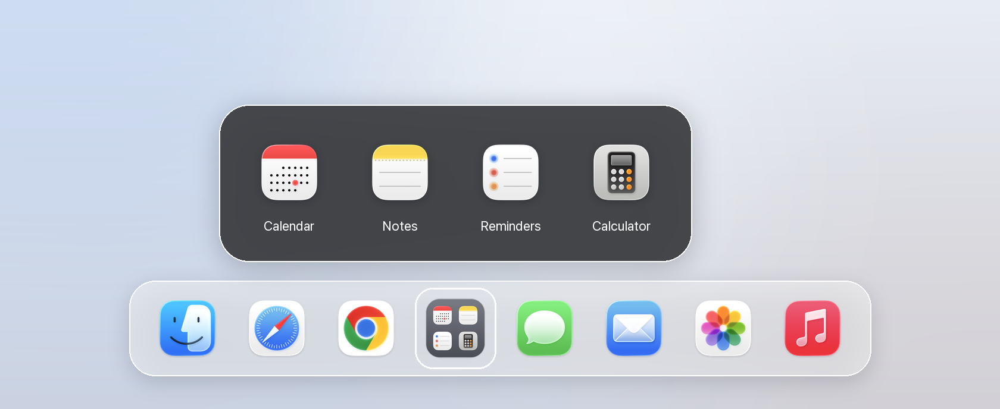
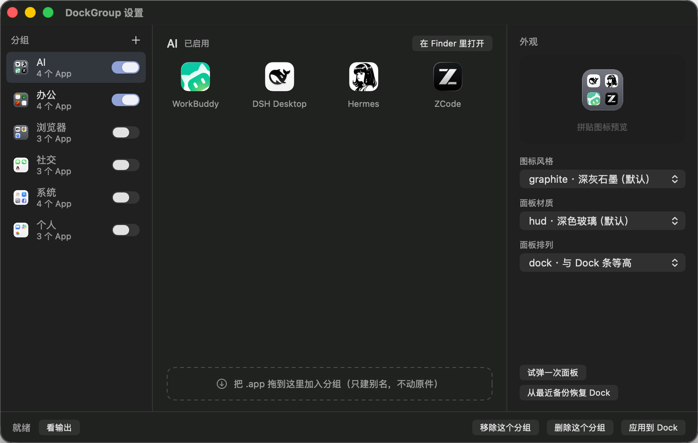
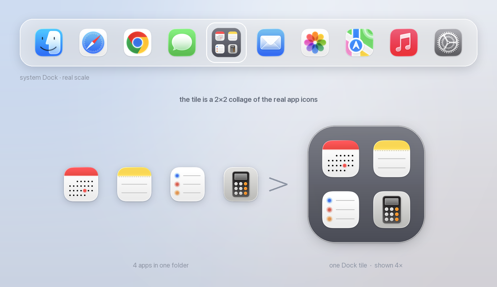
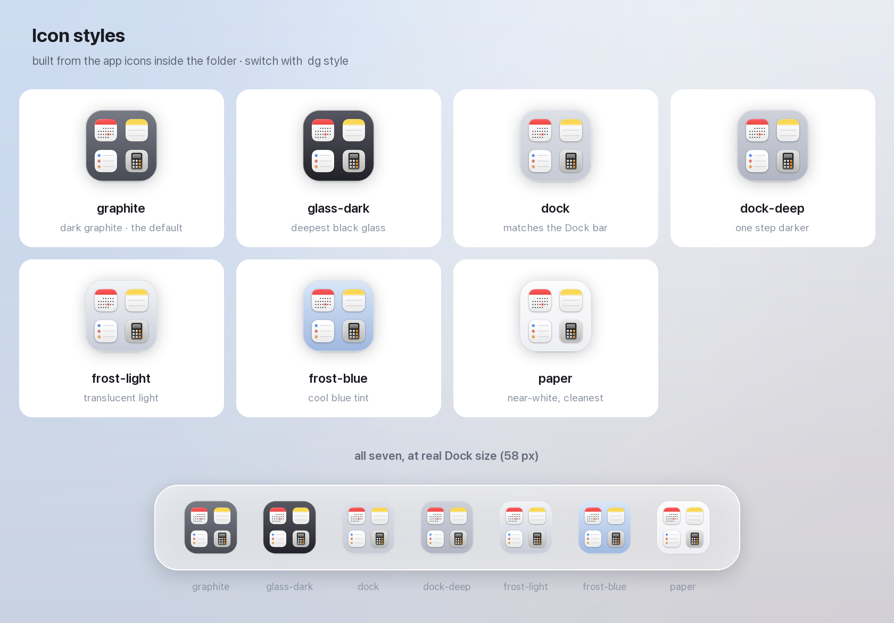
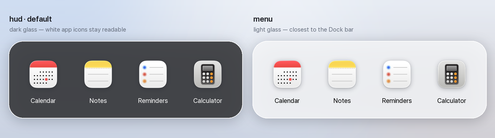
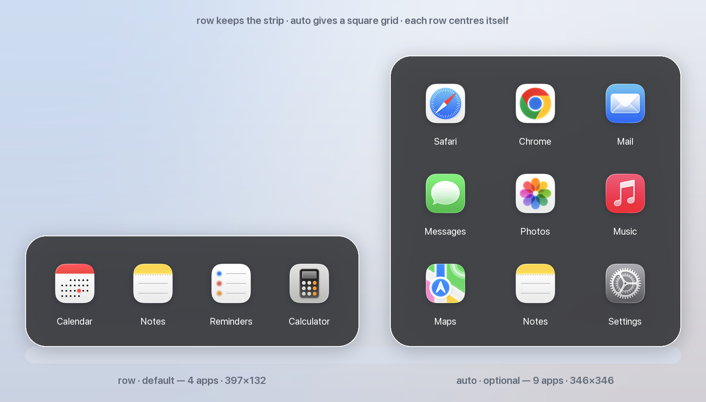

<div align="center">

# dockgroup

**iPhone-style app folders for your macOS Dock — no third-party dock replacement.**

把 macOS Dock 里那堆 App 折叠成一个可点击展开的图标。不改系统 Dock，不装 Dock 替代品，
没有常驻守护进程。



[这是什么](#这是什么) · [安装](#安装) · [快速开始](#快速开始) · [用法](#用法) · [图形界面](#图形界面) · [外观](#外观) · [出问题时](#出问题时)

</div>

---

## 这是什么

macOS 的 Dock 有个老问题：图标越加越多，一条栏塞二十几个，找 App 得用眼睛扫一遍。
iPhone 早就用文件夹解决了，而 macOS **从来没把这个交互搬过来** —— 你把一个 Dock 图标
拖到另一个上面，什么都不会发生。

`dockgroup` 把这件事补齐：给它一组 App，它生成一个图标，点一下在原位弹出这些 App 的
网格，再点直接启动。

```text
改前   22 个图标：App · Safari · Chrome · ego · 信息 · 微信 · QQ · WorkBuddy · Clash · ZCode · …… · 系统设置
改后   16 个图标：App · Safari · Chrome · ego · 信息 · 微信 · QQ · [AI] · Clash · …… · 系统设置
                                        └─ 点开 [AI] 就是 WorkBuddy / Clash / ZCode / DSH Desktop
```

### 核心特性

| 特性 | 说明 |
|---|---|
| **不接管系统 Dock** | 不改原生 Dock、不装替代品。启动器只在被用过之后短暂驻留，空闲 10 分钟自动退出 |
| **图标实时合成** | 读组内每个 App 的原始图标拼成 2×2；App 换了图标，重跑一次就同步 |
| **放在左侧 App 区** | 位置就是被折叠 App 原来待的地方，不是被甩到最右边 |
| **文件夹是唯一事实来源** | 往分组文件夹里拖 App 就等于加进分组，不用改配置 |
| **一条命令增删** | `dg add AI chrome` 自动建别名、重建图标、刷新 Dock；`dg del` 只删别名，**绝不碰你的真实 App** |
| **支持拖放** | 在 Finder 里把 App 拖到 Dock 的分组图标上就加入分组，不用敲终端 |
| **7 种图标风格 · 13 种面板材质** | 默认 `graphite` 图标 + `hud` 深色玻璃面板 |
| **面板排列可换** | 默认是贴 Dock 的长条；`dg layout --all auto` 换成四宫格 / 九宫格，`dg layout --all dock` 换成**和 Dock 条一样高**的一条 |
| **一键回滚** | 每次改 Dock 前自动备份 plist，`dg restore` 秒回原样 |

---

## 安装

**方式 A（推荐）：下载预编译发布包 —— 解压、双击，全程不用终端。**
到 [Releases](https://github.com/wjvalue/macos-dock-folders/releases) 下载
`dockgroup-vX.Y.Z-prebuilt.zip`，解压后双击 `tools/install.command`，它一条龙做完：

1. 装 `dg` 命令（universal 二进制，Apple Silicon / Intel 通吃）
2. 把启动器 / 管理窗口的预编译二进制预置进缓存，之后 `apply` 现场免编译
3. **构建图形界面 `DockGroup.app` 并放进「应用程序」** —— 装完双击即用，
   加 App、换外观、应用到 Dock / 回滚全在窗口里点

预编译包**不需要 Command Line Tools，也不需要 Python 和 Pillow**。

> **引擎说明**：`dg` 的 20 个命令已全部用 Swift 重写，预编译包里就是编译好的
> 二进制。源码安装保留一条 Python 回退路径（`scripts/dockgroup.py`），两套实现
> 有逐字节对照测试（`tools/compare_cli.sh`）把关，行为一致 —— Python 版待
> 预编译分发稳定后退役，日常使用建议走方式 A。

**方式 B：源码安装。** 适合想改代码的人。依赖就下面这些。
**Pillow 不在 macOS 自带依赖里**，需要单独装一次 ——
也是唯一一个得手动补的（`tools/install.command` 会发现缺了并顺手装上）。

| 依赖 | 用来干什么 | 怎么来 |
|---|---|---|
| `/usr/bin/python3` | 跑脚本本身 | 随 Xcode Command Line Tools |
| **Pillow** | 合成分组图标的拼贴图 | `/usr/bin/python3 -m pip install --user Pillow` |
| `swiftc` | 编译分组启动器 / 管理窗口 | 随 Xcode Command Line Tools |
| `codesign` `iconutil` `sips` | App 临时签名、打包 `.icns`、缩放 PNG | **macOS 自带** |
| `osascript` | 调 AppKit / Foundation | **macOS 自带** |

也就是说**只有 `python3` 和 `swiftc` 来自 Command Line Tools**，其余都是系统自带。
（`codesign` / `iconutil` / `sips` 一直被人当成 CLT 的一部分，其实不是 ——
`xcrun -f iconutil` 解析回 `/usr/bin/iconutil`，CLT 的 bin 目录里也没有它们。）

```bash
git clone https://github.com/wjvalue/macos-dock-folders.git
cd macos-dock-folders

# 体检：确认依赖齐全
/usr/bin/python3 scripts/dockgroup.py doctor
```

缺 Command Line Tools 的话：`xcode-select --install`。

源码安装也要装一个短命令 `dg`（此时它是包一层 `/usr/bin/python3` 的 shim；
预编译包装上的 `dg` 直接就是二进制）。**最省事的是双击 `tools/install.command`**：
补 Pillow + 装 `dg` + 清隔离标记 + 生成图形界面 + 体检一条龙，而且它**不会覆盖**
你已经装过的 `dg`。手动装也就三行：

```bash
mkdir -p ~/.local/bin
printf '#!/bin/bash\nexec /usr/bin/python3 "%s/scripts/dockgroup.py" "$@"\n' "$PWD" > ~/.local/bin/dg
chmod +x ~/.local/bin/dg

# 确认 ~/.local/bin 在 PATH 里（zsh 用户写进 ~/.zshrc）
export PATH="$HOME/.local/bin:$PATH"
```

> 脚本里写死 `/usr/bin/python3` 是有意的：Pillow 装进的是**它**的 user site
> （`~/Library/Python/3.9/lib/python/site-packages`）。用 `env python3` 可能解析到
> Homebrew / conda 的解释器，那些读不到这份 Pillow，于是照样报「缺少 Pillow」。

### 打不开？被 Gatekeeper 拦住了？

macOS 只对**从网络下载来的**文件打 `com.apple.quarantine` 标记。带这个标记的 `.app`
即使签名完整，首次打开也会被拦下报「无法验证开发者」—— **这不是签名坏了**，
是隔离标记在起作用，清掉就能开。

| 你怎么拿到这份代码 | 会不会被拦 | 怎么办 |
|---|---|---|
| `git clone` | **不会**。git 不写隔离标记 | 直接用 |
| 下载 zip 解压 | 会（整个目录都带标记） | 双击 `tools/install.command`，或在仓库根目录跑 `xattr -cr .` |
| 别人直接给你 `.app` | 会 | 右键 →「打开」；或 `xattr -cr "那个.app"` |

构建流程本身还有一道兜底：每次生成分组启动器 / 管理窗口都会清一遍隔离标记，
所以哪怕源码是下载来的，产物也是干净的。`dg doctor` 会报告签名身份和隔离状态。

> **为什么不做 Apple 签名和公证**：那需要 Apple Developer 账号（$99/年）。这个项目
> 是个人开源，所以用 ad-hoc 签名（`codesign -s -`）。ad-hoc 签名本机自用完全没问题 ——
> 只有「把 `.app` 二进制直接发给别人」才会撞上上面的拦截，而推荐的分发方式
> （源码 + 本地构建）本来就不受影响。

---

## 快速开始

```bash
# 1. 扫描当前 Dock，生成起始配置
$ dg init

# 2. 建一个分组（App 名支持模糊匹配，也会去 LaunchServices 里找）
$ dg new AI "WorkBuddy" "ZCode" "Hermes" "DSH Desktop"
已添加分组「AI」（4 个 App）

# 3. 先看图标长什么样（不动 Dock）
$ dg preview AI

# 4. 满意了再写进 Dock
$ dg apply AI
```

> 不想敲命令的话，`dg gui` 直接开图形界面：加 App、换外观、应用/回滚都能点，
> 见[图形界面](#图形界面)。

---

## 用法

### 命令一览

```text
dg                     不带参数 = 帮助 + 当前分组状态
dg new  组名 "App" ...  新建分组          （dg new --apply 组名 "App"...  建完直接写进 Dock）
dg add  组名 "App" ...  往分组里加 App     （自动刷新图标并重启 Dock）
dg del  组名 "App" ...  从分组里删 App     （自动刷新）
dg apply [组名...]      生成并写入 Dock（不填 = 全部启用中的分组）
dg apply --keep-originals     保留左侧原图标，不自动摘除重复项
dg list                查看配置 + 文件夹现状 + Dock 挂载状态
dg preview [组名...]   预览拼贴图标，不改动 Dock
dg rebuild             全部重新生成图标并重启 Dock
dg style [组名|--all] [材质]   换面板底色（不带参数 = 看现状 + 材质清单）
dg layout [组名|--all] [模式]  换网格布局（不带参数 = 看现状 + 每组的实际网格）
dg open    组名        在 Finder 里打开分组文件夹（往里面拖 App）
dg test    组名        手动启动一次，验证点击展开效果
dg logs    组名        查看运行日志（面板几何 + 点击事件轨迹）
dg remove  组名...     从 Dock 移除（保留文件夹）
dg clean   组名...     从 Dock 移除并删除文件夹
dg doctor              体检：检查依赖是否齐全
dg init [--force]      扫描当前 Dock，生成起始 groups.json
dg watch-install       安装自动监听：文件夹一变就自动刷新图标
dg watch-uninstall     卸载自动监听
dg restore             用最近一次备份恢复 Dock
dg --help              完整说明
```

`add` / `del` 的 App 名支持**模糊匹配**，也会去 LaunchServices 里找 —— 所以
`dg add AI chro` 就能加上 Google Chrome，`dg add AI 备忘录` 也行。

### 交互模式（不想记组名、不想拼 App 名）

`add` 和 `new` **不带任何参数**直接回车就进入引导：列出分组、列出已安装的 App，
敲数字多选，回车确认。建新分组时还会问你要不要直接写进 Dock，一步到位。

```text
$ dg add
把 App 加到哪个分组：
    1. AI           4 个 App
    2. 办公           4 个 App
    ...
输入序号（q=取消）> 1

共 86 个已安装 App。先输关键词缩小范围，再敲序号多选（如 1 或 1,3 或 2-4）。
关键词过滤（回车=全部，q=完成选择）> chrom
    1. Google Chrome
选择（1-1/1，k=重新过滤，q=完成）> 1
  ✓ 已选 Google Chrome（共 1 个）
    1. Google Chrome  ✓已选
选择（1-1/1，k=重新过滤，q=完成）> q

将把以下 App 加进「AI」：
  · Google Chrome
确认？ [y] >
```

已在分组里的 App 会标记 `·已在该组` 并自动跳过，不会重复添加。

### 拖放模式（最接近手机的操作）

把 App 加进分组**可以完全不用终端**：在 Finder 里打开 `/Applications`，把 App 图标拖到
Dock 上的分组图标上 —— 松手时分组图标会高亮，自动建别名加入分组、刷新拼贴图标，
展开的面板也立刻刷新。拖到展开的网格面板上同样有效。

- 只接受 `.app`，别的东西拖上去不会接管
- 建的是**别名**，不是移动 —— 你的真实 App 绝不会挪窝
- 可以一次拖多个

> **一个做不到的事**：macOS 不允许把一个 **Dock 图标**拖到另一个 Dock 图标上
> （拖动 Dock 图标时整个会话被 Dock 接管，只能排序或拖出去移除）。所以
> 「Dock 图标拖到 Dock 图标上合并」这种手机式交互，在不接管整个 Dock 的前提下
> 原理上做不到 —— 拖放的来源必须是 Finder 里的 App 文件。
> 想要那种交互只能用第三方 Dock 替代品（如 Dockish，$6.99，接管整个 Dock）。

### 常见操作

| 想做什么 | 怎么做 |
|---|---|
| 加 App | Finder 里把 App 拖到 Dock 分组图标上；或 `dg add 组名 App名`；或 `dg add` 交互选 |
| 删 App | `dg del 组名 App名`，或 `dg del 组名` 交互选 |
| 改名 / 排序 | 重命名文件夹里的别名（网格和 Dock 都按名称排序） |
| 刷新图标 | `add` / `del` / 拖放已自动完成；要整体重刷用 `dg rebuild` |
| 换面板底色 | `dg style 组名 hud` / `dg style --all menu` |
| 换网格布局 | `dg layout 组名 row`（长条）/ `dg layout --all auto`（自适应网格）/ `dg layout --all dock`（和 Dock 条等高）/ `dg layout 组名 3`（固定 3 列） |
| 撤销一切 | `dg restore` |

> **`dg del` 只删别名，不碰真实 App。** 如果文件夹里放的确实是 App 本体（而不是别名），
> 它会识别出来并拒绝删除，提示你手动处理。
>
> 手动往文件夹里拖 App 也可以，但**必须按住 ⌘ ⌥** —— 那才是建别名；不按修饰键是
> 「移动」，会真的把 App 搬出 `/Applications`。用 `dg add` 没有这个风险。

装了 `watch-install` 的话，直接在文件夹里增删也会自动刷新图标。

---

## 图形界面

不想敲命令（或者只想看看换成别的样式长什么样），用图形界面 —— `dg gui` 开管理窗口：



```bash
dg gui              # 预编译包秒开（二进制已预置）；源码安装第一次现场 swiftc（约十秒），之后走缓存
dg gui --rebuild    # 改过窗口源码后强制重编译
```

| 位置 | 能做什么 |
|---|---|
| **左栏** | 切换分组；开关某个分组进不进 Dock；新建分组 |
| **中栏** | 看分组里有哪些 App；从 Finder 拖 `.app` 进来；悬停点 `−` 移除 |
| **右栏** | 换图标风格 / 面板材质 / 面板排列，**改完立刻重算预览图** |
| **底栏** | 应用到 Dock / 移除 / 删除 / 看引擎输出 |

**外观改动不会当场写 Dock。** 右侧预览是即时重算拼贴图标的，但要让 Dock 真变，
还得点「应用到 Dock」。这个分界是故意的：7 种风格 × 13 种材质 × 4 种排列挨个试
一遍，试错成本为零；满意了再落地。（点「应用到 Dock」时会顺手结束正在运行的面板
进程 —— 不这么做的话，你点开看到的还是旧布局。）

窗口本身也是 `swiftc` 编出来的单个二进制 + 手写 Info.plist，和分组启动器同一套
构建方式 —— 不引入 Xcode 工程，也不引入任何第三方依赖。想改界面就改
`scripts/manager/main.swift`，然后 `dg gui --rebuild`。

> **它和命令行什么关系**：增删 App、应用、移除、回滚这些会改配置的动作，窗口一律
> 转发给 `dg` 引擎执行（预编译包是 Swift 二进制，源码安装是 Python 版）；只有「外观」三项是窗口直接写 `groups.json` 的
> （为了能即时预览，不至于每拖一下就重启一次 Dock）。两边共用同一套逻辑，
> 配置文件格式也逐字节一致，不会各说各话。

---

## 外观

### 在系统 Dock 里长什么样

分组图标就是一个**普通 App 图标**：尺寸、基线、悬停高亮、点击反馈和系统自带图标完全一致，
混在 Dock 里看不出是生成的。



| 项目 | 说明 |
|---|---|
| **尺寸** | 58 × 58 px，与 Dock 里其它 App 图标同尺寸、同垂直基线 |
| **位置** | 左侧 App 区（`placement: "left"`），默认落在被折叠 App 原来的位置 |
| **名称** | 就是分组名，取自 `groups.json` 里的 `name` |
| **悬停 / 点击** | 和普通图标一样；点击在图标**正上方**原位弹出分组面板 |
| **拖放目标** | 从 Finder 把 `.app` 拖上去即加入分组，松手时图标高亮 |

图标本身是**实时合成**的：读组内每个 App 的原始图标 → 按 iOS 主屏文件夹的比例拼成
2×2 → 套上风格底板。文件夹内容一变（`add` / `del` / 拖放 / `watch` 监听），重跑一次就同步。

### 图标风格

7 种预设，用 `style` 字段切换。默认 `graphite` 不是随便定的：**在 58 px 的真实 Dock 尺寸下
只有实心底板撑得住** —— 半透明淡底、无底板纯拼贴、纯描边框这三种容器会直接消失，只剩几个
图标散着；而纯白底板又会让白底 App 图标（GitHub、Hermes、不少开发工具都是）糊进背景。



| 风格 | 说明 |
|---|---|
| `graphite` | **默认。** 深灰石墨底，白底 App 图标在上面最清楚 |
| `glass-dark` | 更深的黑玻璃，图标像浮在上面 |
| `dock` | 与 Dock 栏同调的浅灰 |
| `dock-deep` | 比 `dock` 再深一档；图标整体偏灰白时用 |
| `frost-light` | 半透明浅玻璃 |
| `frost-blue` | 冷调蓝玻璃 |
| `paper` | 接近纯白，最干净 |

换风格：改 `groups.json` 里的 `style`，再跑 `dg rebuild`。

### 弹出面板

面板弹在 Dock 图标正上方，默认排成贴着 Dock 的一条横带，也可以换成四宫格 / 九宫格，
或者换成**和 Dock 条一样高**的一档（见[面板里的排列](#面板里的排列)）。点空白处 / `Esc` / 切走即自动关闭。
**面板本体只有图标和名字，
没有任何格子底块** —— 和原生 Dock Stack 一致。（试过两种带底块的版式：深灰底块像一张表格，
白磨砂底块像一排白瓷片和浅色玻璃糊在一起，都淘汰了。）

材质默认是深色玻璃 `hud`，不是浅色的 `menu`。原因很实际：不少 App 的图标本身就是
「白底圆角卡片」（DSH Desktop、Hermes、备忘录…），放在浅色玻璃上边界会直接糊进背景，
连形状都丢了；深色玻璃上这些白底图标反而最清楚，整体观感也更接近系统 Dock 文件夹展开的样子。



```bash
dg style                 # 看当前用了什么 + 列出所有可选材质
dg style --all hud       # 全部改成深色玻璃
dg style AI menu         # 只改「AI」这一个分组
dg style AI default      # 「AI」退回全局默认
```

可选材质：`hud`（默认，深色玻璃）/ `menu`（半透明灰玻璃，最接近 Dock 栏）/
`popover`（接近纯白）/ `toolTip` / `sidebar` / `header` / `titlebar` / `underWindow` /
`contentBackground` / `sheet` / `windowBackground` / `appearanceBased` / `fullScreenUI`。

**分组里写的材质优先于全局默认**，所以可以全局定基调、个别分组单独换风格。

### 面板里的排列

默认是**长条**：能铺一行就铺一行，超过 4 个按 4 列换行，面板就是贴在 Dock 上的
一条横带。想要手机主屏那种网格，一条命令切过去 —— 3~4 个应用排成 **2×2 四宫格**，
7~9 个排成 **3×3 九宫格**。两种模式里，每一行都**独立居中**，最后一行不满也不会歪。

嫌这条横带比 Dock 高出一大截（132 pt 对 72 pt）的话，还有三档**贴着 Dock 尺寸**的
排列。尺寸来自现场实测：Dock 条高 **72 pt**，Dock 里的图标 **42.5 pt**。

| 模式 | 4 个应用 | 长什么样 |
|---|---|---|
| `dock` | 254 × 72 | 和 Dock 条**等高**。图标 44 ≈ Dock 图标同大、上下留白同样是 14 pt，摆在 Dock 上方就像同一条栏的延续。**不画名字**，指针停上去出系统提示 |
| `dock-name` | 378 × 80 | 同样贴 Dock，但让出 8 pt 给名字：图标 42 = Dock 图标同大，名字照常显示 |
| `dock-grid` | 144 × 144 | **和 Dock 条两倍等高**的无字网格。格子取正方 55、图标 44（同样是 Dock 图标同档），两行正好是条高的两倍 —— 2×2 于是既是 72 × 2，又天然是正方形。行数多了按行数线性长高（6 个 App 是 205 × 144） |

`dock-grid` 和 `auto` 的区别值得说一句：`auto` 是独立的大格子（100）+ 名字，**根本不
看 Dock 尺寸**；`dock-grid` 一切都从条高推，所以它永远和 Dock 成整数倍关系。



```bash
dg layout                          # 看当前设置 + 每个分组实际排成几宫格、面板多大
dg layout --all auto               # 全部换成自适应网格
dg layout --all row                # 全部换回长条（默认）
dg layout --all dock               # 全部换成和 Dock 条等高（不显示名字）
dg layout --all dock-grid          # 全部换成和 Dock 两倍等高的无字网格
dg layout 办公 dock-name           # 只让「办公」用等高 + 名字
dg layout 浏览器 auto              # 只让「浏览器」用网格
dg layout 办公 3                   # 只让「办公」固定 3 列
dg layout 办公 default             # 「办公」退回全局默认
```

| 应用数 | `row`（默认，长条） | `auto`（可选，网格） |
|---|---|---|
| 1 | 1×1 · 118 × 132 | 1×1 · 132 × 132 |
| 2 | 2×1 · 211 × 132 | 2×1 · 239 × 132 |
| 3 | 3×1 · 304 × 132 | **2×2 · 239 × 239** |
| 4 | 4×1 · 397 × 132 | **2×2 · 239 × 239** |
| 5~6 | 4×2 · 397 × 239 | 3×2 · 346 × 239 |
| 7~9 | 4×2 · 397 × 239 | **3×3 · 346 × 346** |
| ≥10 | 4×3 · 397 × 346 | 4×3 · 453 × 346 |

| 应用数 | `dock`（等高） | `dock-name`（等高 + 名字） |
|---|---|---|
| 1 | 1×1 · 80 × 72 | 1×1 · 102 × 80 |
| 2 | 2×1 · 138 × 72 | 2×1 · 194 × 80 |
| 3 | 3×1 · 196 × 72 | 3×1 · 286 × 80 |
| 4 | 4×1 · 254 × 72 | 4×1 · 378 × 80 |
| 5~8 | 4×2 · 254 × 122 | 4×2 · 378 × 150 |
| 9~12 | 4×3 · 254 × 172 | 4×3 · 378 × 220 |

`auto` 下 1~2 个刻意不用 2×2：容器会有 239 pt 高却只装一两个图标，下半截空着像没加载完。
`dock` 两档的高度是**按屏幕可用区实时推算**的（`可用区高度 - 8`，夹在 56~96 pt），
所以你改了 Dock 图标大小，面板高度会跟着走。

**分组里写的布局优先于全局默认**，和材质是同一套规则 —— 可以全局用长条、某个分组
单独开网格，反过来也行。

> **各模式的格子宽度不同**，这是有意的：长条 86 pt（横向排开更紧凑），网格 100 pt
> （= 格子高度，宽高相等时 n×n 的面板才是正方形，也就是手机上文件夹的比例），
> `dock` 52 pt（图标 44 撑满 72 pt 的条高，不需要给名字留宽度）。
>
> 86 pt 这个下限是被标签逼出来的：收到 80 pt 时「DSH Desktop」会被截成「DSH Deskt...」。
> 但再宽也救不了超长名字 —— `Numbers Creator Studio`、`Google Chrome` 这类在两种宽度
> 下都仍会截断。
>
> `dock` 干脆不画名字，靠系统悬停提示兜底（原生 Dock 也是这么做的）—— 72 pt 的高度里
> 塞不下「图标 + 一行可读的字」，硬塞只会两头都不舒服。

### 改版式时怎么验证

两条路各有用途，别混用：

- **比布局** → 离屏渲染，不用真弹窗，一次能出好几版：

  ```bash
  DOCKGROUP_RENDER=/tmp/panel.png "$HOME/Dock Groups/.apps/AI.app/Contents/MacOS/DockGroupLauncher"
  ```

- **比材质 / 看圆角和阴影** → 必须真机截图。离屏渲染看不到窗口阴影，毛玻璃还会退化成
  透明，**用它判断材质会得出完全错误的结论**（踩过）：

  ```bash
  screencapture -x -R x,y,w,h /tmp/region.png    # 屏幕合成，最接近肉眼所见
  screencapture -x -l <窗口号> /tmp/win.png      # 只要窗口本体，不含阴影
  ```

---

## 配置 `groups.json`

配置默认读 `~/Dock Groups/groups.json`（可用环境变量 `DOCKGROUP_HOME` 改落盘目录）。

```json
{
  "style": "graphite",
  "material": "hud",
  "layout": "row",
  "groups": [
    {
      "name": "AI",
      "enabled": true,
      "placement": "left",
      "after": "/Applications/QQ.app",
      "apps": ["/Applications/WorkBuddy.app", "/Applications/ZCode.app"]
    }
  ]
}
```

| 字段 | 说明 |
|---|---|
| `style` | 全局图标风格，默认 `graphite`，见[图标风格](#图标风格) |
| `material` | 全局面板材质，默认 `hud`，见[弹出面板](#弹出面板) |
| `layout` | 全局面板排列，默认 `row`（长条），见[面板里的排列](#面板里的排列) |
| `groups[].name` | 分组名，同时也是 Dock 上图标显示的名字和文件夹名 |
| `groups[].enabled` | `apply` 不带参数时是否应用它；`apply <组名>` 会忽略此项 |
| `groups[].placement` | `left`（默认，启动器 App）/ `right`（原生文件夹 Stack） |
| `groups[].after` | 可选。显式指定插在哪个 App 后面；不写则**自动落位**到被折叠 App 的原位置 |
| `groups[].apps` | 首次播种用；文件夹建好之后以文件夹内容为准 |
| `groups[].material` | 可选。只覆盖这一个分组的面板材质 |
| `groups[].layout` | 可选。只覆盖这一个分组的网格布局（`auto` / `row` / `2` / `3` / `4`） |

---

## 实现与取舍

### 引擎：从 Python + Pillow 到全 Swift

`dg` 的 20 个命令现在全部由 Swift 实现（`swift/`，`swiftc` 直接编译，不引
Xcode 工程 / SPM / 第三方依赖）。动机是**零运行期依赖**：迁移前一半功能在
Python（2400 行）和 Pillow 手上，用户必须装 Command Line Tools **和** Pillow
才能跑；配上预编译分发，现在用户端连 CLT 都不必装。

迁移走的绞杀者模式：两套实现并存 → 逐命令对齐 → 全部对齐后切换。每个命令都要过
`tools/compare_cli.sh` 的逐行 diff —— 终端输出、写盘的 `groups.json`、生成的
bundle 结构、合成图标的像素都在比对范围内，这是唯一的正确性关卡。Python 版
（`scripts/dockgroup.py`）保留作源码安装的回退，待预编译分发稳定后退役。
迁移策略与不能破的约定见 [`swift/README.md`](swift/README.md)。

### 为什么默认是 App 而不是文件夹 Stack

Dock 支持把文件夹放进去（Stack），但它有个硬限制：

| `placement` | Dock tile 类型 | 位置 | 点击行为 |
|---|---|---|---|
| `left`（默认） | 启动器 **App**（`file-tile`） | 左侧 App 区，任意位置 | 弹出图标网格 ✅ |
| `right` | 文件夹 **Stack**（`directory-tile`） | **只能在分隔线右侧** | 原生 Stack 网格 |

文件夹 tile 写进 `persistent-apps`（左侧区）后 Dock 是接受的、重启也不弹回去，
**但点击会打开 Finder 窗口，不会弹网格** —— Stack 的弹窗逻辑和 tile 所在区域绑定，
没有任何 plist 字段能改。

所以要在左侧位置 + 点击展开，只能自己做成 App：`scripts/launcher/main.swift` 会编译出一个
约 130 KB 的启动器，`LSUIElement=true`（不留运行圆点、不进 Cmd-Tab），点击后在图标正上方
弹出一个毛玻璃网格面板。

### 落盘位置

```text
~/Dock Groups/
├── AI/                     ← 分组文件夹（App 别名 + 自定义图标），事实来源
├── .apps/AI.app/           ← 生成的启动器 App
├── .cache/                 ← 拼贴图标、App 图标缓存、预览图、运行日志
├── .backup/                ← 每次改 Dock 前自动备份的 plist
└── groups.json
```

### 已知限制

- 左侧模式依赖手写 `persistent-apps`。macOS 不让你拖，但接受 plist 写入（已实测重启 Dock
  后保留）。这种写法**不保证跨系统大版本升级继续有效**，所以备份机制是必需的。
- **启动器是常驻式的**：面板收起后进程会留 10 分钟（`DOCKGROUP_IDLE_SECONDS` 可调），
  之后再点就是秒开。不「用完即退」是刻意的 —— 见排障表里「已不能再打开」那条。
  一个空闲的 accessory 进程，不占 Dock 图标、不进 Cmd-Tab。
- 面板位置基于点击瞬间的鼠标坐标，所以只有从 Dock 点击才精准；从终端启动会弹在鼠标当前位置。
- 文件夹 Stack 模式（`placement: "right"`）只能待在 Dock 分隔线右侧，这是系统限制。

---

## 出问题时

| 现象 | 处理 |
|---|---|
| 点击图标没反应 | 跑 `dg logs <组名>`，日志会指出断点：<br>· 只有 `=== launch`、没有 `mouseDown hit item` → 点击没送达视图<br>· 有 `mouseDown` 但没有 `launching` → 命中下标 / 路径有问题<br>· 有 `launching` 但 `openApplication` 报错 → LaunchServices 拒绝启动<br>· 出现 `dismiss: click outside panel` → 被误判成点了面板外 |
| 弹出面板关不掉 / 点 Dock 上别处不收起 | 已修（两个成因）：① 刷新面板时没关掉旧面板，旧窗口留在屏幕上；② 全局监听把 Dock 区的点击一律忽略。`dg logs` 里 `window … visible=true` 超过一条就是又漏关了 |
| 拖 App 上去 Dock 图标不高亮 | 启动器缺 `CFBundleDocumentTypes` 声明 → `dg rebuild` 重新生成并注册 |
| 拖一次却加了两遍 | 同一个拖放事件系统会送两次 → 已有 10 秒去重；无新增时不刷新、不重启 Dock |
| 提示「应用程序"X"已不能再打开」 | 两种成因，都已修：① 旧版每次 `apply` / `rebuild` 都重写 bundle，LaunchServices 因此作废 App 记录 → 现在内容没变就一个字节都不动；② 旧版用完立刻退出进程，连点时 Dock 会尝试再启动一个实例被拒 → 现在启动器常驻，第二次点击走 reopen 切换 |
| 点击打开的是 Finder 窗口 | 说明用的是文件夹 Stack 却在左侧 → 把 `placement` 改成 `left` 后 `apply` |
| 弹出栏被 Dock 挡住 | 已修（历史 bug：`NSPanel.isFloatingPanel` 会把窗口层级压到 3）。重跑 `apply` 重新编译 |
| 面板四角有直角块 | 已修：圆角得一路裁到窗口层（theme frame + 毛玻璃 `maskImage` + `invalidateShadow`），只给内容视图设圆角不够 |
| 换了 material 但面板没变化 | ① `appearance` 必须设在毛玻璃视图上，只设 window 无效；② `bundle-stamp` 缓存跳过了重写 → `rm ~/Dock\ Groups/.cache/*.bundle-stamp` 再 `dg rebuild` |
| 改了布局 / 材质，点开面板还是老样子 | ① **最常见：旧的面板进程还在跑。** 启动器收起后要常驻一小段时间（否则 Dock 会报「已不能再打开」），而它的布局是**进程启动时**读进内存的，之后重建 bundle 也影响不到它 → `dg apply` / `dg rebuild` / `dg add` 都会自动结束旧进程，但手工改 bundle 不会。自查：`pgrep -lf DockGroupLauncher`，有残留就 `pkill -f DockGroupLauncher`；② **这个分组自己写了 `layout` / `style` / `material`，覆盖了全局** → 管理窗口里这类分组会标一个橙色滑块图标，右栏写明覆盖了什么并给一键「改回跟随全局」；命令行用 `dg layout` 看每个分组的实际模式、`dg layout 组名 default` 清掉覆盖；③ `bundle-stamp` 缓存跳过了重建 → `rm ~/Dock\ Groups/.cache/*.bundle-stamp` 再 `dg rebuild`；④ `dg logs <组名>` 里 `panel: layout=[…] grid=…x…` 一行能直接对账 |
| 图标没跟着文件夹内容变 | `dg rebuild` |
| Dock 条目被系统丢弃 | `dg restore` 回滚，再手动把 App 拖回 Dock |
| 想彻底撤销 | `dg restore` |

更多实现细节和完整踩坑记录见 [`references/pitfalls.md`](references/pitfalls.md)。

---

## 作为 AI Agent Skill 使用

仓库根目录的 `SKILL.md` 是给 AI 编码助手（Claude Code / WorkBuddy 等）用的技能定义。
把它放进你的 skills 目录即可：

```bash
ln -s "$PWD" ~/.workbuddy/skills/macos-dock-folders
```

---

## 开发

`docs/` 下的配图由脚本生成，不靠手工截图 —— 手工截图做不到统一的背景、留白和字体，
而且容易把终端内容一起截进去。脚本复用同一套图标提取与合成算法（生产引擎已切到
Swift，但两套实现产出逐字节一致，配图脚本直接 import Python 版最省事），只是换了
个「舞台」：

```bash
/usr/bin/python3 tools/readme_assets.py     # 重新生成 docs/*.png
```

Swift 引擎的开发说明（迁移策略、对照测试、不能破的约定）见
[`swift/README.md`](swift/README.md)；预编译发布包用 `tools/build-release.sh`
构建（`dg` / 启动器 / 管理窗口三个 universal 二进制 + 源码树，打成一个 zip）。

## License

[MIT](LICENSE)
