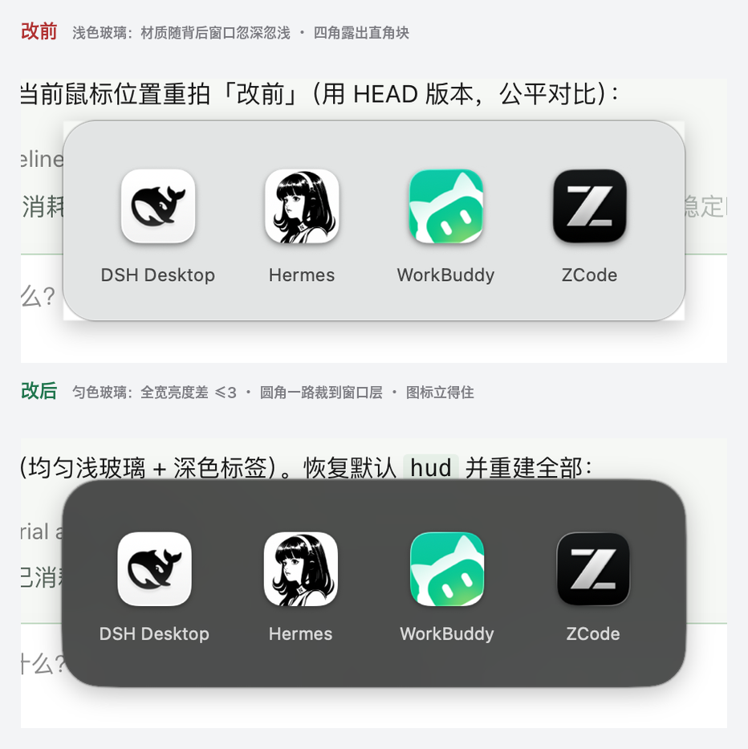
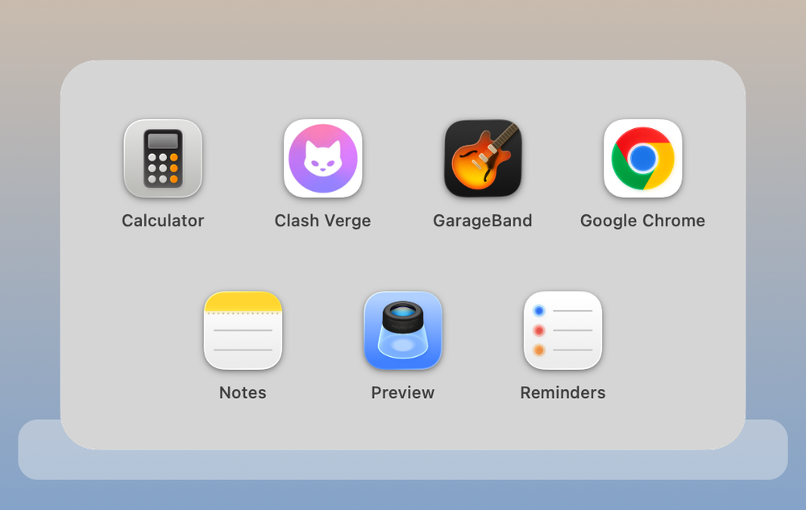
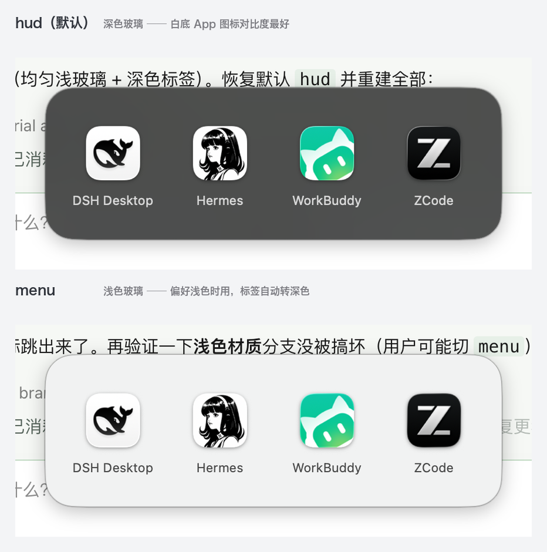

<div align="center">

# dockgroup

**iPhone-style app folders for your macOS Dock — without a third-party dock replacement.**

把 macOS Dock 里的一堆 App 折叠成一个可点击展开的图标 —— 不改系统 Dock，不装 Dock 替代品。


</div>

---

## 这是什么

macOS 的 Dock 有个老问题：图标越加越多，一条栏塞二十几个，找个 App 得用眼睛扫一遍。
iPhone 早就用文件夹解决了，但 macOS **从来没把这个交互搬过来** —— 你把一个 Dock 图标拖到另一个上面，什么都不会发生。

`dockgroup` 把这件事补齐：给它一组 App，它生成一个图标，点一下在原位弹出这些 App 的网格，再点直接启动。

```
改前：App · Safari · Chrome · ego · 信息 · 微信 · QQ · WorkBuddy · Clash · …… · ZCode   （22 个）
改后：App · Safari · Chrome · ego · 信息 · 微信 · QQ · [AI] · Clash · …… · 系统设置      （16 个）
                                                        └─ 点击展开 4 个 agent 类 App
```

## 特性

- **不需要第三方 Dock** —— 不改系统 Dock，不装 Dock 替代品，没有常驻守护进程（启动器只在用过后短暂驻留，10 分钟无操作自动退出）
- **图标是实时合成的** —— 读取组内每个 App 的原始图标，拼成 2×2 拼贴图；App 换图标后重跑一次就同步
- **可以放在左侧 App 区** —— 位置就在被折叠 App 原来待的地方，不是被甩到最右边
- **分组文件夹是唯一事实来源** —— 往文件夹里拖 App 就等于加进分组，不需要改配置
- **一条命令增删 App** —— `dg add AI chrome` 就完事：自动建别名、重建图标、刷新 Dock。`dg del AI chrome` 同理，而且只删别名、**绝不碰你的真实 App**
- **支持拖放** —— 在 Finder 里把 App 图标拖到 Dock 上的分组图标（或展开的网格面板）上，自动加入分组，**不用敲终端**
- **装一次短命令** —— 之后全用 `dg xxx`，不用再敲长路径和 `python3`
- **7 种图标风格** —— 默认 `graphite`（深灰底，白底 App 图标在上面最清楚），另有 `dock` / `dock-deep` / `paper` / `frost-light` / `frost-blue` / `glass-dark`
- **一键回滚** —— 每次改 Dock 前自动备份 plist，`restore` 秒回原样

## 界面与风格

面板弹在 Dock 图标正上方，点空白处 / Esc / 切走即自动关闭（见上方示意图）。

**面板本体只有图标和名字，没有任何格子底块** —— 和原生 Dock Stack 一致。
（试过两种带底块的版式：深灰底块像一张表格，白磨砂底块像一排白瓷片和浅色玻璃糊在一起，
都淘汰了。）


**默认用深色玻璃（`hud`），不是浅色的 `menu`。** 原因很实际：不少 App 的图标本身
就是「白底圆角卡片」（DSH Desktop、Hermes、备忘录…），放在浅色玻璃上边界会直接
糊进背景，形状都丢了；深色玻璃上这些白底图标反而最清楚，整体观感也更接近系统
Dock 文件夹展开的样子。

**面板上盖了一层「匀色底」。** 毛玻璃（`blendingMode = .behindWindow`）会实时采样
窗口**背后**的内容，面板又弹在任意窗口之上 —— 背后左边是深色终端、右边是浅色桌面时，
玻璃就左半边深、右半边浅，像被劈成两半（实测同一块面板内部亮度能从 50 平滑爬到 154）。
压一层半透明匀色底把自适应抹平后，全宽亮度差 ≤3，任何背景下都是同一块稳定的表面。
深色材质压黑、浅色材质压白，所以两种外观都是「提高不透明度」而不是「染色」。

四角是**连续曲率的正圆角，而且一路裁到窗口层**（含窗口阴影和背后的毛玻璃）——
只给内容视图设圆角的话，四角会各露出一个直角块。改前改后：



格子按 4 列排，超过就换行，**每行独立居中**（最后一行不满也不会歪）：



两种材质都做过真机验证，切换后观感一致：



### 换底色

```bash
dg style                 # 看当前用了什么 + 列出所有可选材质
dg style --all hud       # 全部改成深色玻璃
dg style AI menu         # 只改「AI」这一个分组
dg style AI default      # 「AI」退回全局默认
```

可选材质：`hud`（默认，深色玻璃）/ `menu`（半透明灰玻璃，最接近 Dock 栏）/
`popover`（接近纯白）/ `toolTip` / `sidebar` / `header` / `titlebar` / `underWindow` /
`contentBackground` / `sheet` / `windowBackground` / `appearanceBased` / `fullScreenUI`。
**分组里写的材质优先于全局默认**，所以可以全局定基调、个别分组单独换风格。

图标风格在 64px 真实 Dock 尺寸下的表现：


换图标风格：改 `groups.json` 里的 `style`，再跑 `dg rebuild`。

> **改版式时怎么验证**，两条路各有用途：
>
> **① 比布局** → 离屏渲染，不用真弹窗，一次能出好几版：
>
> ```bash
> DOCKGROUP_RENDER=/tmp/panel.png "$HOME/Dock Groups/.apps/AI.app/Contents/MacOS/DockGroupLauncher"
> ```
>
> **② 比材质 / 看圆角和阴影** → 真机截图。离屏渲染看不到窗口阴影，
> 毛玻璃还会退化成透明，**用它判断材质会得出完全错误的结论**（踩过）：
>
> ```bash
> screencapture -x -R x,y,w,h /tmp/region.png    # 屏幕合成，最接近肉眼所见
> screencapture -x -l <窗口号> /tmp/win.png      # 只要窗口本体，不含阴影
> ```

> 实测结论一：**只有实心卡片和实心深色玻璃能撑住 64px**。
> 半透明淡底、无底板纯拼贴、纯描边框这三种在真实 Dock 尺寸下容器会消失，只剩几个图标散着，全部淘汰。
>
> 实测结论二：**底板别用纯白**。很多 App 图标本身就是白底圆角方块
> （GitHub、Hermes、不少开发工具都是），放在纯白底板上会和背景糊成一片，
> 只剩中间的彩色 logo 能看见、形状丢了。用与 Dock 栏同调的浅灰（`dock`）
> 它们才显出轮廓；每个图标再叠一层很轻的投影，边缘会更清楚。
> 图标偏灰白的话可以再深一档用 `dock-deep`。

## 安装

```bash
git clone https://github.com/wjvalue/macos-dock-folders.git
cd macos-dock-folders

# 体检：确认依赖齐全
/usr/bin/python3 scripts/dockgroup.py doctor
```

依赖：macOS 上自带的东西 —— `/usr/bin/python3`（含 Pillow）、`osascript`，
以及 [Xcode Command Line Tools](https://developer.apple.com/xcode/resources/) 提供的 `swiftc` / `codesign` / `iconutil` / `sips`。
若缺 CLT：`xcode-select --install`。

```bash
# 装一个短命令 dg（自动把当前路径写进去，之后直接敲 dg 就行）
mkdir -p ~/.local/bin
printf '#!/bin/bash\nexec /usr/bin/python3 "%s/scripts/dockgroup.py" "$@"\n' "$PWD" > ~/.local/bin/dg
chmod +x ~/.local/bin/dg

# 确认 ~/.local/bin 在 PATH 里（zsh 用户写进 ~/.zshrc）
export PATH="$HOME/.local/bin:$PATH"
```

> 脚本里写死 `/usr/bin/python3` 是有意的：**系统自带的 Python 才带 Pillow**，
> 用 `env python3` 可能解析到不带 Pillow 的解释器。

## 快速开始

```bash
# 1. 扫描当前 Dock，生成起始配置
$ dg init

# 2. 建一个分组（App 名支持模糊匹配，也会去 LaunchServices 里找）
$ dg new AI "WorkBuddy" "ZCode" "Hermes" "DSH Desktop"
已添加分组「AI」（4 个 App）

# 3. 先看图标长什么样（不动 Dock）
$ dg preview AI

# 4. 满意了再写进 Dock
$ dg apply AI
```

## 用法

```
dg                     不带参数 = 帮助 + 当前分组状态
dg add  组名 "App" ...  往分组里加 App（自动刷新图标并重启 Dock）
dg del  组名 "App" ...  从分组里删 App（自动刷新）
dg new  组名 "App" ...  新建分组
dg new --apply 组名 "App" ...   新建分组并一步写进 Dock
dg apply [组名...]      生成并写入 Dock（不填 = 全部启用中的分组）
dg apply --keep-originals    保留左侧原图标，不自动摘除重复项
dg list                查看配置 + 文件夹现状 + Dock 挂载状态
dg preview [组名...]   预览拼贴图标，不改动 Dock
dg rebuild             全部重新生成图标并重启 Dock
dg style [组名|--all] [材质]   换面板底色（不带参数 = 看现状 + 材质清单）
dg open    组名        在 Finder 里打开分组文件夹（往里面拖 App）
dg test    组名        手动启动一次，验证点击展开效果
dg logs    组名        查看运行日志（面板几何 + 点击事件轨迹）
dg remove  组名...     从 Dock 移除（保留文件夹）
dg clean   组名...     从 Dock 移除并删除文件夹
dg doctor              体检：检查依赖是否齐全
dg init [--force]      扫描当前 Dock，生成起始 groups.json
dg watch-install       安装自动监听：文件夹一变就自动刷新图标
dg watch-uninstall     卸载自动监听
dg restore             用最近一次备份恢复 Dock
dg --help              完整说明
```

`add` / `del` 的 App 名支持**模糊匹配**，也会去 LaunchServices 里找 —— 所以
`dg add AI chro` 就能加上 Google Chrome，`dg add AI 备忘录` 也行。

### 交互模式（不想记组名、不想拼 App 名时）

`add` 和 `new` **不带任何参数**直接回车，就进入引导：列出分组、列出已安装的
App，敲数字多选，回车确认。建新分组时还会问你要不要直接写进 Dock，一步到位。

```
$ dg add
把 App 加到哪个分组：
    1. AI           4 个 App
    2. 办公           4 个 App
    ...
输入序号（q=取消）> 1

共 86 个已安装 App。先输关键词缩小范围，再敲序号多选（如 1 或 1,3 或 2-4）。
关键词过滤（回车=全部，q=完成选择）> chrom
    1. Google Chrome
选择（1-1/1，k=重新过滤，q=完成）> 1
  ✓ 已选 Google Chrome（共 1 个）
    1. Google Chrome  ✓已选
选择（1-1/1，k=重新过滤，q=完成）> q

将把以下 App 加进「AI」：
  · Google Chrome
确认？ [y] >
```

已在分组里的 App 会标记 `·已在该组` 并自动跳过，不会重复添加。

### 拖放模式（最接近手机的操作）

把 App 加进分组**可以不用终端**：在 Finder 里打开 `/Applications`（或任何放 App 的
地方），把 App 图标拖到 Dock 上的分组图标上 —— 松手时分组图标会高亮，
自动建别名加入分组、刷新拼贴图标，面板立刻刷新。拖到展开的网格面板上也一样。

- 只接受 `.app`，别的东西拖上去不会接管
- 建的是**别名**，不是移动 —— 你的真实 App 绝不会挪窝
- 可同时拖多个

> **一个做不到的事**：macOS 不允许把一个 **Dock 图标**拖到另一个 Dock 图标上
> （拖动 Dock 图标时整个会话被 Dock 接管，只能排序或拖出去移除）。所以
> 「Dock 图标拖到 Dock 图标上合并」这种手机式交互，在不接管整个 Dock 的前提下
> 原理上做不到 —— 拖放的来源必须是 Finder 里的 App 文件。
> 想要那种交互只能用第三方 Dock 替代品（如 Dockish，$6.99，接管整个 Dock）。

## 日常维护

**分组文件夹是唯一事实来源。** 启动器在运行时现读该文件夹，所以加了 App 立刻就能点；拼贴图标则由 `add` / `del` 自动刷新。

```bash
dg add AI "备忘录"     # 加一个，自动刷新图标并重启 Dock
dg del AI "备忘录"     # 删一个，同样自动刷新
dg add AI chro        # App 名支持模糊匹配
```

也可以直接操作文件夹（两种方式等价）：

```bash
dg open AI            # 在 Finder 里打开分组文件夹
```

| 想做什么 | 怎么做 |
|---|---|
| 加 App | Finder 里把 App 拖到 Dock 分组图标上；或 `dg add 组名 App名`；或 `dg add` 交互选 |
| 删 App | `dg del 组名 App名`，或 `dg del 组名` 交互选 |
| 改名 / 排序 | 重命名文件夹里的别名（网格和 Dock 都按名称排序） |
| 刷新图标 | `add` / `del` / 拖放已自动完成；要整体重刷用 `dg rebuild` |

> **`dg del` 只删别名，不碰你的真实 App。** 如果文件夹里放的确实是 App 本体
> （而不是别名），它会识别出来并拒绝删除、提示你手动处理。

手动往文件夹里拖 App 也可以，但**必须按住 ⌘ ⌥** —— 那才是建别名；
不按修饰键是「移动」，会真的把 App 搬出 `/Applications`。用 `dg add` 没有这个风险。

装了 `watch-install` 的话，直接在文件夹里增删也会自动刷新。

## 配置 `groups.json`

```json
{
  "style": "dock",
  "groups": [
    {
      "name": "AI",
      "enabled": true,
      "placement": "left",
      "apps": ["/Applications/WorkBuddy.app", "/Applications/ZCode.app"]
    }
  ]
}
```

| 字段 | 说明 |
|---|---|
| `style` | 全局图标风格，默认 `dock`（与 Dock 栏同调的浅灰），见上方对比 |
| `material` | 弹出面板的底色材质，默认 `menu`（与 Dock 栏同套灰玻璃） |
| `enabled` | `apply` 不带参数时是否应用它；`apply <组名>` 会忽略此项 |
| `placement` | `left`（默认，启动器 App）/ `right`（原生文件夹 Stack） |
| `after` | 可选。显式指定插在哪个 App 后面；不写则**自动落位**到被折叠 App 的原位置 |
| `apps` | 首次播种用；文件夹建好之后以文件夹内容为准 |

配置默认读 `~/Dock Groups/groups.json`（可用环境变量 `DOCKGROUP_HOME` 改落盘目录）。

## 两种模式：为什么默认是 App 而不是文件夹

Dock 支持把文件夹放进去（Stack），但它有个硬限制：

| `placement` | Dock tile 类型 | 位置 | 点击行为 |
|---|---|---|---|
| `left`（默认） | 启动器 **App**（`file-tile`） | 左侧 App 区，任意位置 | 弹出图标网格 ✅ |
| `right` | 文件夹 **Stack**（`directory-tile`） | **只能在分隔线右侧** | 原生 Stack 网格 |

文件夹 tile 写进 `persistent-apps`（左侧区）后 Dock 是接受的、重启也不弹回去，
**但点击会打开 Finder 窗口，不会弹网格** —— Stack 的弹窗逻辑和 tile 所在区域绑定，
没有任何 plist 字段能改。

所以要在左侧位置 + 点击展开，只能自己做成 App：
`scripts/launcher/main.swift` 会编译出一个约 130 KB 的启动器，`LSUIElement=true`
（不留运行圆点、不进 Cmd-Tab），点击后在图标正上方弹出一个毛玻璃网格面板。

## 落盘位置

```
~/Dock Groups/
├── AI/                     ← 分组文件夹（App 别名 + 自定义图标），事实来源
├── .apps/AI.app/           ← 生成的启动器 App
├── .cache/                 ← 拼贴图标、App 图标缓存、预览图、运行日志
├── .backup/                ← 每次改 Dock 前自动备份的 plist
└── groups.json
```

## 出问题时

| 现象 | 处理 |
|---|---|
| 点击图标没反应 | 跑 `dg logs <组名>`，日志会指出断点：<br>· 只有 `=== launch`，没有 `mouseDown hit item` → 点击没送达视图<br>· 有 `mouseDown` 但没有 `launching` → 命中下标/路径有问题<br>· 有 `launching` 但 `openApplication` 报错 → LaunchServices 拒绝启动<br>· 出现 `dismiss: click outside panel` → 被误判成点了面板外 |
| 弹出面板关不掉 | 已修（两个成因）：<br>① 刷新面板时没关掉旧面板 → 旧窗口留在屏幕上且没人管它<br>② 全局监听把 Dock 区的点击一律忽略 → 点 Dock 上别的地方面板不收起<br>`dg logs <组名>` 里 `window … visible=true` 超过一条就是又漏关了 |
| 点 Dock 上别的图标，面板不收起 | 同上 ②，已修 |
| 拖 App 上去 Dock 图标不高亮 | 启动器缺 `CFBundleDocumentTypes` 声明 → `dg rebuild` 重新生成并注册 |
| 拖一次却加了两遍 | 同一个拖放事件系统会送两次 → 已有 10 秒去重；无新增时不刷新、不重启 Dock |
| 提示「应用程序"X"已不能再打开」 | 两种成因，都已修：<br>① 旧版每次 `apply/rebuild` 都重写 bundle，LaunchServices 因此作废 App 记录 → 现在内容没变就一个字节都不动<br>② 旧版用完立刻退出进程，连点时 Dock 会尝试再启动一个实例被拒 → 现在启动器常驻，第二次点击走 reopen 切换 |
| 点击打开的是 Finder 窗口 | 说明用的是文件夹 Stack 却在左侧 → 把 `placement` 改成 `left` 后 `apply` |
| 弹出栏被 Dock 挡住 | 已修（历史 bug：`NSPanel.isFloatingPanel` 会把窗口层级压到 3）。重跑 `apply` 重新编译 |
| 面板四角有直角块 | 已修：圆角得一路裁到窗口层（theme frame + 毛玻璃 `maskImage` + `invalidateShadow`）。只给内容视图设圆角不够 |
| 换了 material 但面板没变化 | ① `appearance` 必须设在毛玻璃视图上，只设 window 无效<br>② `bundle-stamp` 缓存跳过了重写 → `rm ~/Dock\ Groups/.cache/*.bundle-stamp` 再 `dg rebuild` |
| 图标没跟着文件夹内容变 | `dg rebuild` |
| Dock 条目被系统丢弃 | `dg restore` 回滚，再手动把 App 拖回 Dock |
| 想彻底撤销 | `dg restore` |

更多实现细节和踩坑记录见 [`references/pitfalls.md`](references/pitfalls.md)。

## 作为 AI Agent Skill 使用

仓库根目录的 `SKILL.md` 是给 AI 编码助手（Claude Code / WorkBuddy 等）用的技能定义。
把它放进你的 skills 目录即可：

```bash
ln -s "$PWD" ~/.workbuddy/skills/macos-dock-folders
```

## 已知限制

- 左侧模式依赖手写 `persistent-apps`。macOS 不让你拖，但接受 plist 写入（已实测重启 Dock 后保留）。
  这种写法**不保证跨系统大版本升级继续有效**，所以备份机制是必需的。
- **启动器是常驻式的**：面板收起后进程会留 10 分钟（`DOCKGROUP_IDLE_SECONDS` 可调），之后再点就是
  秒开。不「用完即退」是刻意的 —— 见下方排障表里「已不能再打开」那条。
  一个空闲的 accessory 进程，不占 Dock 图标、不进 Cmd-Tab。
- 面板位置基于点击瞬间的鼠标坐标，因此只有从 Dock 点击才精准；从终端启动会弹在鼠标当前位置。
- 文件夹 Stack 模式（`placement: "right"`）只能待在 Dock 分隔线右侧，这是系统限制。

## License

[MIT](LICENSE)
