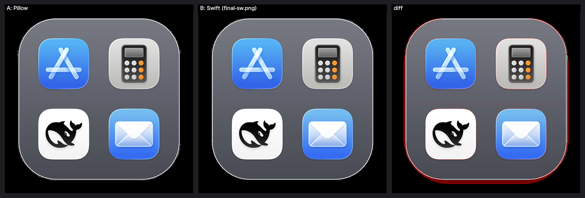

# 可行性验证：用 Swift 原生图形栈替代 Python + Pillow 合成图标

> 2026-09-21。原型在 `tools/mosaic_poc/main.swift`，对比工具在 `tools/compare_png.py`。
> 起因见 [issue #1](https://github.com/wjvalue/macos-dock-folders/issues/1)：有用户建议
> 「用全 Swift 替代 python + Pillow，产品会更一体化」。

## 结论

**可行。** 底板几何、渐变、投影、描边、图标缩放全部对得上，视觉无从分辨。

| 指标 | 结果（5 种风格 × 1~4 个图标，共 20 组） |
|---|---|
| MAE（RGB） | **0.19 ~ 0.30 / 255** |
| PSNR | **60.9 ~ 62.3 dB** |
| 单通道差 >8 的像素 | **0.37% ~ 0.67%** |

剩余差异**全部集中在底板圆角的那一圈轮廓**上（见 `images/spike-mosaic-diff.png` 的红线），
成因是 PIL 用离散折线近似圆弧、CoreGraphics 画精确圆弧，两者相差约 1 像素。视觉不可见。



*左：Pillow 输出。中：Swift 输出。右：差异（放大 8 倍叠加）。*

## 四个坑（按影响从大到小）

这四条都是「跨到 Swift 之后看着能跑、结果就是不对」的类型，而且**症状各不相同**，
不量化对比根本发现不了。

### 1. 色彩空间：写得最像 bug，但它是最大的一个

macOS 的 App 图标都是 **Display P3**。PIL 读取时**不做任何转换**，直接拿原始数值；
而 `CGContext` 一旦用 `CGColorSpaceCreateDeviceRGB()`（sRGB）创建，就会**静默做一次
P3→sRGB 转换**，两边颜色就对不上了。

- 症状：R 通道有 3.8% 的像素差 >32，看起来像「缩放算法烂」
- 修正：`CGContext` 的 `space` 用**源图自己的** `cgImage.colorSpace`
- 效果：超阈值像素 **11.5% → 0.69%**（这一个修正顶其它所有修正之和）

```swift
let cs = cg.colorSpace ?? CGColorSpaceCreateDeviceRGB()   // ← 不能写死 sRGB
```

### 2. PIL 的「高斯模糊」不是高斯

`ImageFilter.GaussianBlur(radius)` 内部是 **3 次 box blur 近似**（Ivan Kutskir 的经典
算法，Pillow 的 `BoxBlur.c` 用的就是它）。用 `CIGaussianBlur` 去对反而对不齐。

- 症状：**带图标投影的风格**差异到 9.5%，**不带投影的只有 0.5%** ——
  这个「按风格分化的差异」就是线索
- 修正：用 `vImageBoxConvolve_Planar8` 做 3 次 box blur，半径照抄该算法：
  `wIdeal = sqrt(12σ²/n + 1)`，`wl` 向下取整到奇数，`wu = wl+2`，
  再按 `m = round(mIdeal)` 决定前几次用 `wl`、后几次用 `wu`
- 效果：最差一档 **9.5% → 2.3%**，且所有风格拉平

### 3. PIL 的矩形是闭区间

`rounded_rectangle((x0,y0,x1,y1))` 覆盖 `x0..x1` **含两端**，宽度是 `x1-x0+1`；
`CGRect` 是半开区间 `[x, x+w)`。

- 症状：底板**右边缘和下边缘**各一条差异带，**左边和上边完全干净** ——
  这种「只有一边不对」的不对称，基本可以直接锁定是边界语义差 1 像素
- 修正：`pilRect()` 把宽高各 +1

### 4. Python 的 `//` 是向下取整，Swift 的 `/` 是向零取整

负数时两者结果不同。`n==2` 布局里 `(side - 2*cell - gap) // 2` 恰好是负数：

```
side=872, cell=479, gap=69  →  (872 - 958 - 69) // 2 = -155 // 2
    Python: -78      Swift: -77      ← 差 1 像素
```

- 症状：**只有 `n==2` 的差异是其它布局的 4 倍**，其它组合都正常
- 修正：`pilDiv()` 复现 Python 的 floor 语义
- 效果：n=2 从 **2.33% → 0.61%**

> 另外 `Image.paste(color, (0,0), mask)` **不是 source-over**，而是逐通道线性插值
> `out[c] = src[c]*m + dst[c]*(1-m)`（alpha 通道也参与）。照 source-over 写会差一截，
> 但这个是读代码就能看出来的，没上榜。

## 修正过程的数据

以 `graphite` + 4 图标为例，每修一个坑就重测一次：

| 阶段 | MAE(RGB) | PSNR | >8 像素 |
|---|---|---|---|
| 初版（CG 插值 + CI 高斯 + sRGB） | 2.481 | 49.73 dB | 11.95% |
| ① 修正矩形闭区间 | 1.904 | 55.40 dB | 11.71% |
| ② 自实现 Lanczos-3（替 CG 插值） | 1.853 | 55.42 dB | 11.61% |
| ③ **修正色彩空间** | 0.351 | 61.68 dB | 0.69% |
| ④ **box blur ×3（替 CI 高斯）** | 0.282 | 61.68 dB | 0.59% |
| ⑤ 修正负数取整（n=2） | 0.282 | 61.68 dB | 0.59% |

②几乎没有收益 —— 因为那时真正的病根（色彩空间）还没找到。
**这也是为什么要做量化对比而不是肉眼看**：肉眼看，②和③之后都「一样」。

## 性能

生成一张 1024×1024、4 图标的合成图：**约 1.8 秒**（含 4 次 Lanczos 缩放和 2 次模糊）。
日常使用完全够 —— 而且这是原型，没做任何优化。

## 复现

```bash
# 编译原型
swiftc -O -o /tmp/mosaic_poc tools/mosaic_poc/main.swift \
       -framework Cocoa -framework CoreImage -framework Accelerate

# 生成两版
/usr/bin/python3 -c "import sys; sys.path.insert(0,'scripts'); \
  from dockgroup import make_mosaic; make_mosaic(['a.png','b.png'], '/tmp/ref.png', style='graphite')"
/tmp/mosaic_poc graphite 1024 /tmp/sw.png a.png b.png

# 量化对比（出 MAE/PSNR/热力图/三联图）
/usr/bin/python3 tools/compare_png.py /tmp/ref.png /tmp/sw.png /tmp/cmp
```

## 还没覆盖的部分

- **7 种风格只测了 5 种**（漏了 `dock-deep`、`frost-light`，但它们和测过的同族）
- **没有验证 `png_to_icns` / `set_folder_icon`**：那是把 PNG 转 `.icns` 并写进文件夹的
  `Icon\r`，目前靠 `iconutil` + JXA。转 Swift 后可以用 `CGImageDestination` 直接写 icns
  的各个尺寸，但**没验证过**。
- **没有验证真实 Dock 里的显示效果**：对比是在像素层面做的，没实际放进 Dock 看。
  考虑到剩余差异只在圆角轮廓的 1 像素上，预期无差别，但没实测。

## 对整体重构的意义

图像这块**风险已排除** —— 它本来是跨语言迁移里最不可控的部分（不像 plist、JSON、
文件操作那样在 Foundation 里有现成对应）。

但要说清楚：**图像只占 `dockgroup.py` 的 31 行**。真正的大头是
**20 个子命令 + Dock plist 读写（142 行命中）**。这个 spike 证明的是「最难的部分能做」，
不是「重构会很轻松」。
